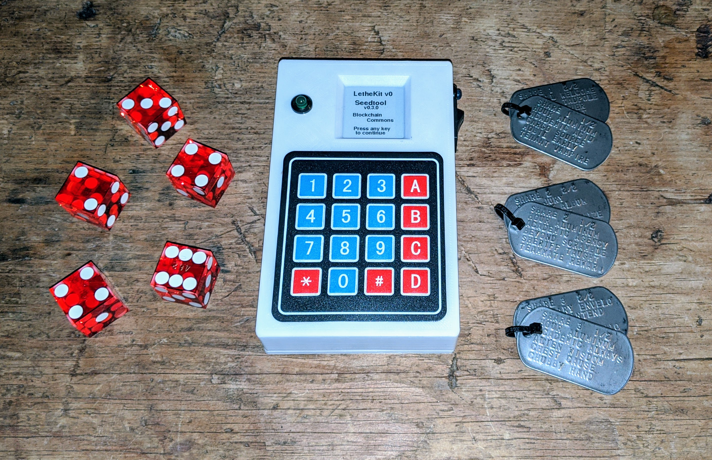

# Blockchain Commons Lethe Kit

**Open source DYI hardware box for offline cryptographic tools**

The Lethe Kit is a DIY platform for performing various sensitive cryptographic operations on an offline/airgapped device with no WiFi or Bluetooth to leak information, the external USB only charges the battery, and there is no local storage, so when you turn it off it forgets any sensitive data stored in RAM. Thus the name Lethe ("lee-thee") from the [mythological river](https://en.wikipedia.org/wiki/Lethe) of forgetfulness and oblivion.

The [Parts List](doc/parts-list.md) describes all needed parts.

The [Case](case) can be 3D printed.

The [Assembly Instructions](doc/assembly.md) show how to put it together.

The [Lethe Kit Installation Instructions](doc/intallation.md) show how to install Lethe Kit in your Arduino development environment.

The [Seedtool Application Instructions](seedtool/README.md) show how to build
and run a sample application.

## Origin, Authors, Copyright & Licenses

Unless otherwise noted (either in this [/README.md](./README.md) or in the file's header comments) the contents of this repository are Copyright © 2020 by Blockchain Commons, LLC, and are [licensed](./LICENSE) under the [spdx:BSD-2-Clause Plus Patent License](https://spdx.org/licenses/BSD-2-Clause-Patent.html).

In most cases, the authors, copyright, and license for each file reside in header comments in the source code. When it does not we have attempted to attribute it accurately in the table below.

This table below also establishes provenance (repository of origin, permalink, and commit id) for files included from repositories that are outside of this repository. Contributors to these files are listed in the commit history for each repository, first with changes found in the commit history of this repo, then in changes in the commit history of their repo of their origin.

| File      | From                                                         | Commit                                                       | Authors & Copyright (c)                                | License                                                     |
| --------- | ------------------------------------------------------------ | ------------------------------------------------------------ | ------------------------------------------------------ | ----------------------------------------------------------- |
| exception-to-the-rule.c or exception-folder | [https://github.com/community/repo-name/PERMALINK](https://github.com/community/repo-name/PERMALINK) | [https://github.com/community/repo-name/commit/COMMITHASH]() | 2020 Exception Author  | [MIT](https://spdx.org/licenses/MIT)                        |

### Used with…

These are other projects that work with or leverage Lethe Kit:

- [community/repo-name/](https://github.com/community/repo-name) — Repo that does what, by [developer](https://github.com/developer)  or from  [community](https://community.com).

### Derived from…

This Lethe Kit project was inspired by:

- [Bitcoin 2019 Conference Tutorial](https://github.com/arcbtc/bitcoin2019conf) — Which provided a fully functional starting point using similar hardware, by [Ben Arc](https://github.com/arcbtc).

### Dependencies

To build the Lethe Kit you'll need to use the following tools:

- autotools - Gnu Build System from Free Software Foundation ([intro](https://www.gnu.org/software/automake/manual/html_node/Autotools-Introduction.html)).

## Contributing

We encourage public contributions through issues and pull-requests! Please review [CONTRIBUTING.md](./CONTRIBUTING.md) for details on our development process. All contributions to this repository require a GPG signed [Contributor License Agreement](./CLA.md).

### Credits

The following people directly contributed to this repository. You can add your name here by getting involved — the first step is to learn how to contribute from our [CONTRIBUTING.md](./CONTRIBUTING.md) documentation.

| Name              | Role                | Github                                            | Email                                 | GPG Fingerprint                                    |
| ----------------- | ------------------- | ------------------------------------------------- | ------------------------------------- | -------------------------------------------------- |
| Christopher Allen | Principal Architect | [@ChristopherA](https://github.com/@ChristopherA) | \<ChristopherA@LifeWithAlacrity.com\> | FDFE 14A5 4ECB 30FC 5D22  74EF F8D3 6C91 3574 05ED |
| Ken Sedgwick      | Project Lead        | [@ksedgwic](https://github.com/ksedgwic)          | \<ken@bonsai.com\>                  | 4695 E5B8 F781 BF85 4326 9639 BBFC E515 8602 5550  |

## Responsible Disclosure

We want to keep all our software safe for everyone. If you have discovered a security vulnerability, we appreciate your help in disclosing it to us in a responsible manner. We are unfortunately not able to offer bug bounties at this time.

We do ask that you offer us good faith and use best efforts not to leak information or harm any user, their data, or our developer community. Please give us a reasonable amount of time to fix the issue before you publish it. Do not defraud our users or us in the process of discovery. We promise not to bring legal action against researchers who point out a problem provided they do their best to follow the these guidelines.

### Reporting a Vulnerability

Please report suspected security vulnerabilities in private via email to ChristopherA@LifeWithAlacrity.com (do not use this email for support). Please do NOT create publicly viewable issues for suspected security vulnerabilities.

The following keys may be used to communicate sensitive information to developers:

| Name              | Fingerprint                                        |
| ----------------- | -------------------------------------------------- |
| Christopher Allen | FDFE 14A5 4ECB 30FC 5D22  74EF F8D3 6C91 3574 05ED |

You can import a key by running the following command with that individual’s fingerprint: `gpg --recv-keys "<fingerprint>"` Ensure that you put quotes around fingerprints that contain spaces.
