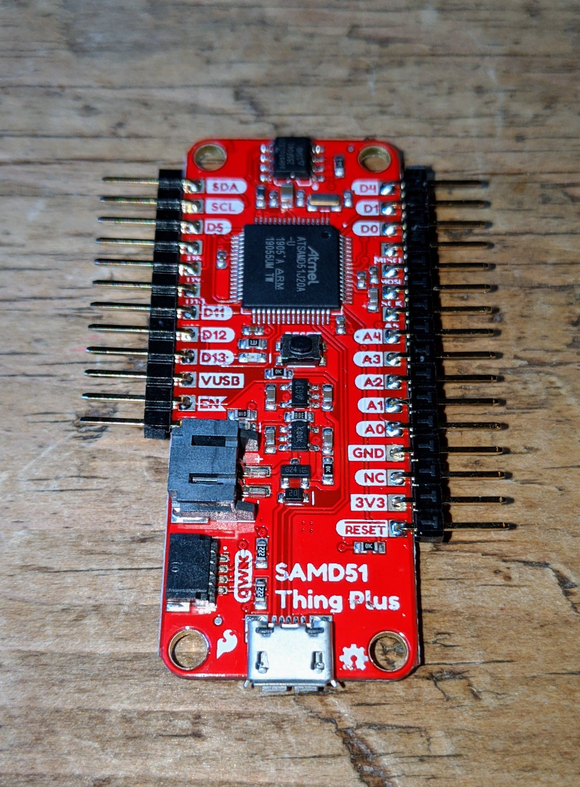
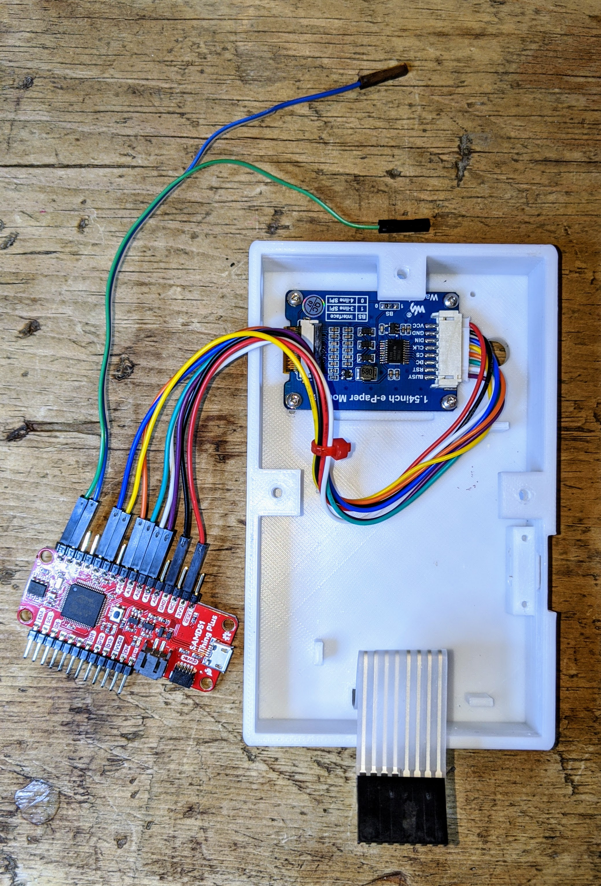
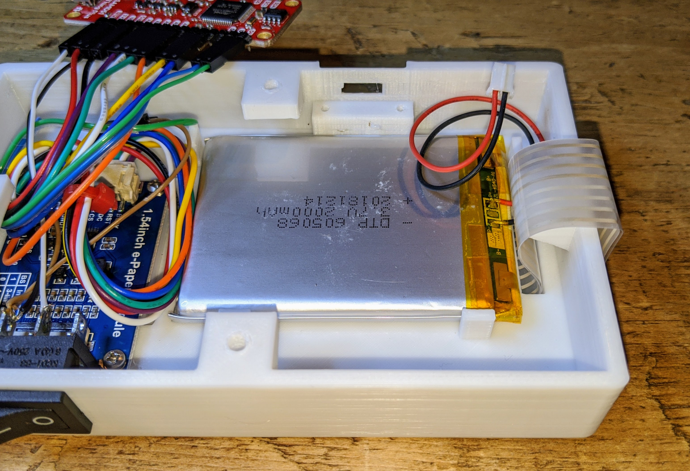
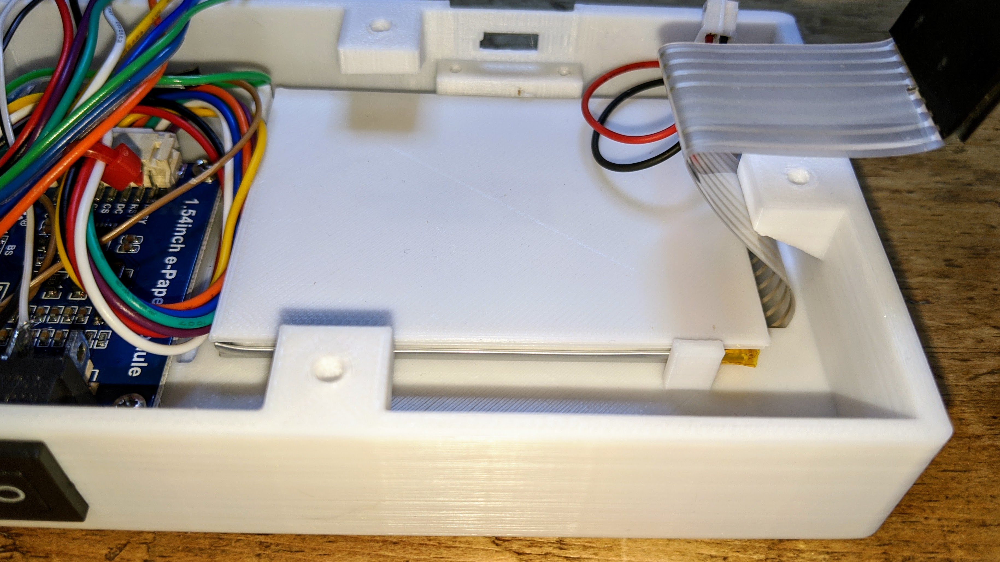
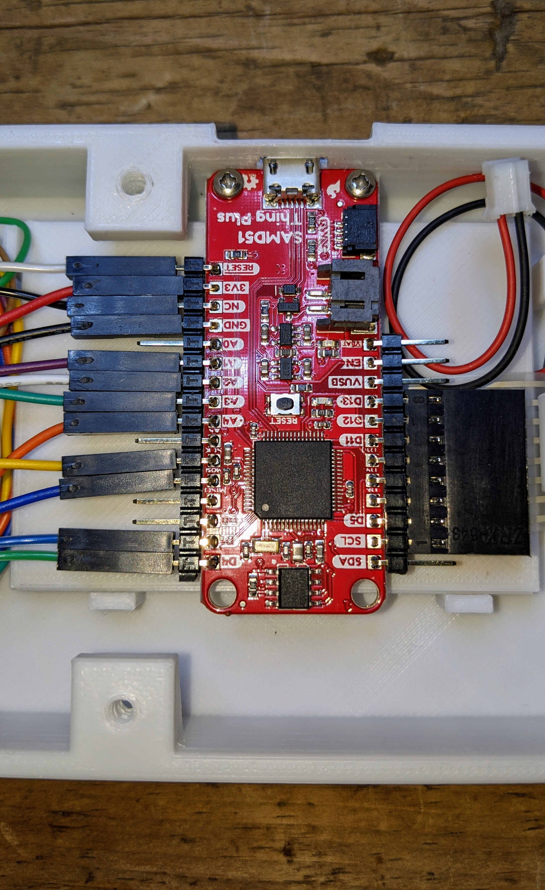
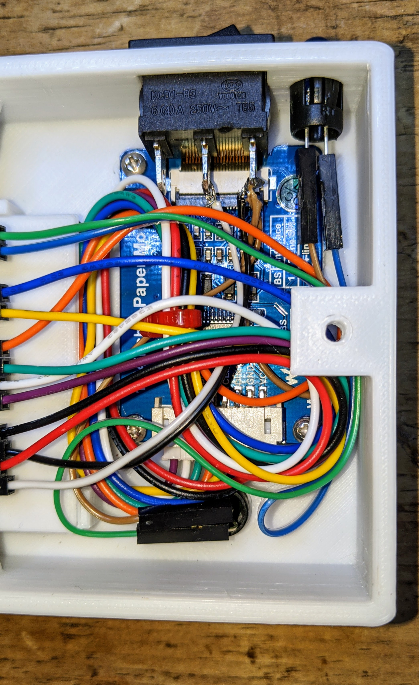
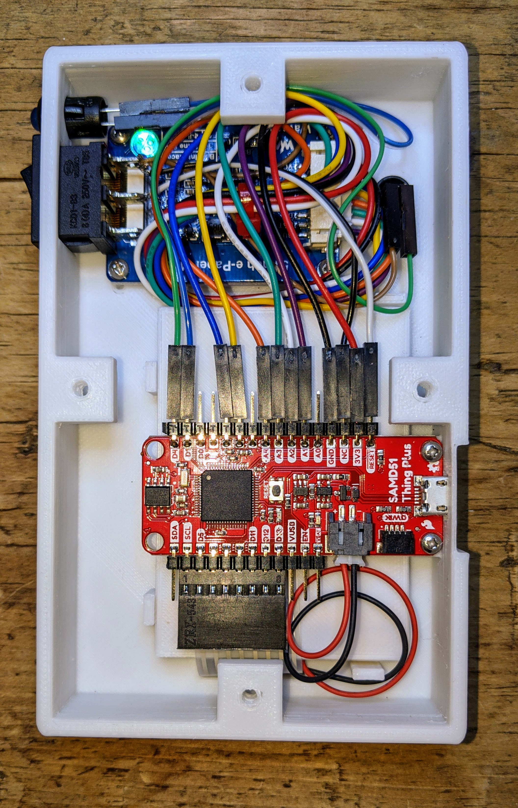

## LetheKit Assembly Instructions

The following steps fully detail how to assemble the LetheKit from its parts.

### Assemble the Switch Harness

_Parts:_ Jumper Wires, Rocker Switch

1. Separate (pull apart) a black/white pair from the **Jumper Wires**.
   Cut this pair in the middle and strip 1cm of the ends on one of the
   halves.

2. Separate a brown wire from the jumper wires. Cut this wire in the
   middle and strip 1cm of the ends on both halves.
   
3. Twist the stripped black lead together with the two stripped brown
   leads and solder to post "1b" on the **Rocker Switch** (under the "1" part of
   the switch).

4. Solder the white lead to the center post of the rocker switch.

### Assemble the Waveshare Display Harness

_Parts:_ Waveshare 200x200 Display Module, (optional) Cable Ties

1. The **Display Module** comes with a cable that has a display connector
   on one end and individual jumper connectors on the other.  Attach
   the display connector end to the display.
   
2. It's helpful to add a small **Cable Tie** (or similar) to the middle of
   the cable cluster to help keep the wires together.

### Connect the SAMD51 Headers

_Parts:_ Break Away Male Headers, SAMD51

1. Break the **Break Away Male Headers** into a 12-pin piece and a 16-pin
   piece.
   
2. Solder the headers onto the top of the **SAMD51** with the pins
   facing away from the board.
   

#### Add a Jumper to SAMD51

An extra ground pin is required on the SAMD51 header.  Luckily, there is
an unused (not-connected) pin that can be commandeered.

_Parts:_ connected SAMD51 with Headers

1. Solder a piece of wire bridging the GND and NC pins on the bottom
   of the **SAMD51**.

### Attach Display Harness to SAMD51

_Parts:_ assembled Waveshare Display Harness, connected SAMD51 with Headers

1. Attach the **Waveshare Display Harness** to the **SAMD51** as shown
   in the picture.

### Assemble LED Wires

_Parts:_ Jumper Wires, connected SAMD51 with Headers

1. Separate a blue and green pair from the **Jumper Wires**.  Split the
   pair most of the way to one side.
   
2.  Attach the non-split side of the pair to the **SAMD51** as
    shown.

    
### Attach Keypad to Case

_Parts:_ Membrane Switch Keypad, 3D Printed Case

1. Insert the **Membrane Switch Keypad** connector through the slot at the bottom of the
   **Case** front.
   
2. Peel the adhesive cover off the back of the Keypad and press it
   into place on the Case as shown.
   

### Attach Display to Case

_Parts:_ Waveshare 200x200 Display Module, 3D Printed Case, 3/16" Phillips Rounded Head Screws

1. Gently attach the **Display Module** to the **Case** with **Phillips Rounded Head Screws**.  DO NOT OVERTIGHTEN
   SCREWS. There are two sets of display holes to support an alternate
   display; use the set which aligns the display in its cutout when
   viewed from the other side of the case.
   
2. It's helpful to dress the display wires towards the bottom of the
   case as they leave the display connector so that they will clear the
   LED when it is inserted through the hole.
   

   
### Attach LEDs to Case

_Parts:_ Blue LED, Green LED, LED Holders, 3D Printed Case

1. Trim the **LED** leds a little. Trim the longer lead to 18mm length
   from the base of the LED and the shorter lead to 16mm.  The lead
   length is used to identify polarity so it's critical to keep the
   longer lead longer than the shorter lead.

2. Insert the **Blue LED** into an **LED holder** and snap it into place in the
   hole in the side of the **Case**, above where the power switch will go.
   It's helpful if the LED's leads are horizontally oriented.
   
3. Insert the **Green LED** into an **LED holder** and snap in into place in the
   hole in the front of the case.  Bend the leads in a 90-degree angle,
   down towards the bottom of the case. Again, it's helpful if the
   leads are oriented horizontally.
   

### Attach the Switch to Case

_Parts:_ Rocker Switch, Switch Harness, 3D Printed Case, assembled SAMD51 with Headers

1. Snap the **Rocker Switch** into place in the **Case**.  Orient the Rocker Switch so the
   "1" side is towards the top of the case.
   

2. Connect the white and black **Switch Harness** leads to the **SAMD51** as
   shown.
   

### Insert Battery

_Parts:_ Lithium Ion Battery, 3D Printed Case

1. Place the **Lithium Ion Battery** into the guides in the **Case** as shown.

### Install Battery Shield

The shield prevents the SAMD51 module from damaging the surface of the
battery.

_Parts:_ 3D Printed Battery Shield

1. Place the **Battery Shield** on top of the battery in the guides as shown.

### Connect the Keypad Connector

_Parts:_ Membrane Switch Keypad, assembled SAMD51 with Headers

1. Connect the the **Membrane Switch Keypad** connector to the **SAMD51** as shown. Note that the
   connector fits "one pin in" from the end of the header.

### Attach SAMD51 to Case

_Parts:_ assembled SAMD51 with Headers, 3D Printed Case, 3/16" Phillips Rounded Head Screws

1. Fit the **SAMD51** into is mounting location on the **Case**.  Attach with **Phillips Rounded Head Screws*8.  DO
   NOT OVERTIGHTEN THE SCREWS.

### Connect LEDS

_Parts:_ Blue LED, Green LED, LED Wires, Switch Harness

1. Connect the green wire from the **LED Wires** to the longer lead of the **Green LED**.

2. Connect the blue wire from the **LED Wires** to the longer lead of the **Blue LED**.

3. Connect one of the brown wires from the **Switch Harness** to the shorter lead of the **Green LED**.

4. Connect the other brown wires from the **Switch Harness** to the shorter lead of the **Blue LED**.

### Connect Battery

_Parts:_ Lithium Ion Battery, assembled SAMD51 with Headers

1. Carefully connect the **Lithium Ion Battery** to the **SAMD51**.  Support the SAMD51 as you insert the connector to avoid stressing the attachment screws.
   
**IMPORTANT** - Always first disconnect the battery when working on
the inside of the terminal to avoid damaging the cicuits.

#### That's It!

#### Attach the Cover

_Parts:_ 3D Printed Cover, Push-in Bumpers, 1/2" Flat Head Screws

1. Press the **Bumpers** into the **Cover**.

2. Attach the **Cover** to the **Case** with the **1/2" Flat Head Screws**.
